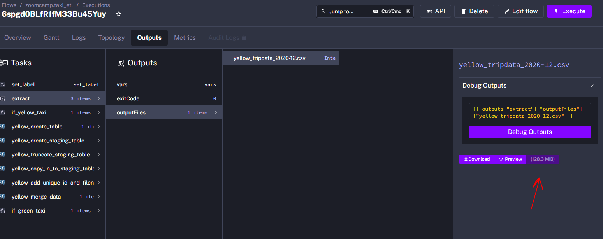
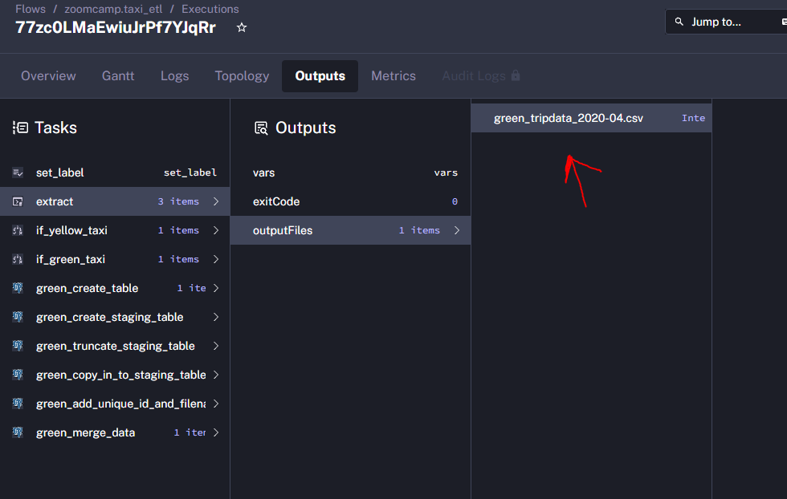

# Data Engineering Zoomcamp 2025

## Module 2 Homework

### Question 1: Yellow Taxi File Size

**Question**: Within the execution for Yellow Taxi data for the year 2020 and month 12: what is the uncompressed file size (i.e. the output file yellow_tripdata_2020-12.csv of the extract task)?

**Options**:
- [x] 128.3 MB
- [ ] 134.5 MB
- [ ] 364.7 MB
- [ ] 692.6 MB

**Solution**: The file size can be verified by checking the output file of the extract task in Kestra flow execution.



### Question 2: Variable Rendering

**Question**: What is the rendered value of the variable `file` when the inputs `taxi` is set to `green`, `year` is set to `2020`, and `month` is set to `04` during execution?

**Options**:
- [ ] {{inputs.taxi}}\_tripdata\_{{inputs.year}}-{{inputs.month}}.csv 
- [x] green_tripdata_2020-04.csv
- [ ] green_tripdata_04_2020.csv
- [ ] green_tripdata_2020.csv

**Solution**: The variable follows the pattern {taxi}\_tripdata\_{year}-{month}.csv, which when rendered with the given inputs becomes green_tripdata_2020-04.csv.



### Question 3: Yellow Taxi Rows 2020

**Question**: How many rows are there for the Yellow Taxi data for all CSV files in the year 2020?

**Options**:
- [ ] 13,537,299
- [x] 24,648,499
- [ ] 18,324,219
- [ ] 29,430,127

**SQL Query**:
```sql
SELECT
    COUNT(*) as total_rows
FROM public.yellow_tripdata
WHERE
    filename LIKE 'yellow_tripdata_2020-__.csv';
```

**Results**:
| total_rows |
|------------|
|  24648499  |

### Question 4: Green Taxi Rows 2020

**Question**: How many rows are there for the Green Taxi data for all CSV files in the year 2020?

**Options**:
- [ ] 5,327,301
- [ ] 936,199
- [x] 1,734,051
- [ ] 1,342,034

**SQL Query**:
```sql
SELECT
    COUNT(*) as total_rows
FROM public.green_tripdata
WHERE
    filename LIKE 'green_tripdata_2020-__.csv';
```

**Results**:
| total_rows |
|------------|
|  1734051   |

### Question 5: Yellow Taxi March 2021

**Question**: How many rows are there for the Yellow Taxi data for the March 2021 CSV file?

**Options**:
- [ ] 1,428,092
- [ ] 706,911
- [x] 1,925,152
- [ ] 2,561,031

**SQL Query**:
```sql
SELECT
    COUNT(*) as total_rows
FROM public.yellow_tripdata
WHERE
    filename LIKE 'yellow_tripdata_2021-03.csv';
```

**Results**:
| total_rows |
|------------|
|  1925152   |

### Question 6: Timezone Configuration

**Question**: How would you configure the timezone to New York in a Schedule trigger?

**Options**:
- [ ] Add a timezone property set to EST in the Schedule trigger configuration
- [x] Add a timezone property set to America/New_York in the Schedule trigger configuration
- [ ] Add a timezone property set to UTC-5 in the Schedule trigger configuration
- [ ] Add a location property set to New_York in the Schedule trigger configuration

**Solution**: According to the [Kestra documentation](https://kestra.io/docs/workflow-components/triggers/schedule-trigger), the correct format for timezone configuration uses the IANA timezone database format, where "America/New_York" is the proper identifier for New York's timezone.